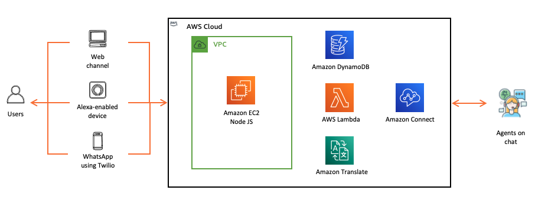

# Omnichannel Multilingual Contact Center #
This project recognizes the Contact center industry's critical language barrier issue between an agent and a customer while being on a live conversation. This project would perform Real-time translation of the conversation between an Agent and the customer using multiple channels of communication. 

## Overview ##

In this connected world, organizations have users across the globe, it brings in a unique challenge of managing users expectations with each speaking different languages and connecting to them to the right agent while following the sun model. Agents being the face of your company, are the first ones who interacts with the customers, so leaving a pleasant impression on customer’s mind shall be of utmost importance for any organisation.

The Solution leverages Amazon Connect as the Cloud based Contact Center used by the Agents to send messages. A Node.js server is used as a Broker to link Amazon Connect with the multiple channels used by customers. This server auto identifies customer’s language & performs a Real-time Bi-directional translation in the native language of Customer/Agent using Amazon Translate.

Multiple Channels used for communication by Customers: 
- Web 
- Alexa using voice 
- WhatsApp

## Architecture ##

## Authors ##
- Jackysh Bangera jackyshb@amazon.com 
- Gaurav Sahi sahgaura@amazon.com
